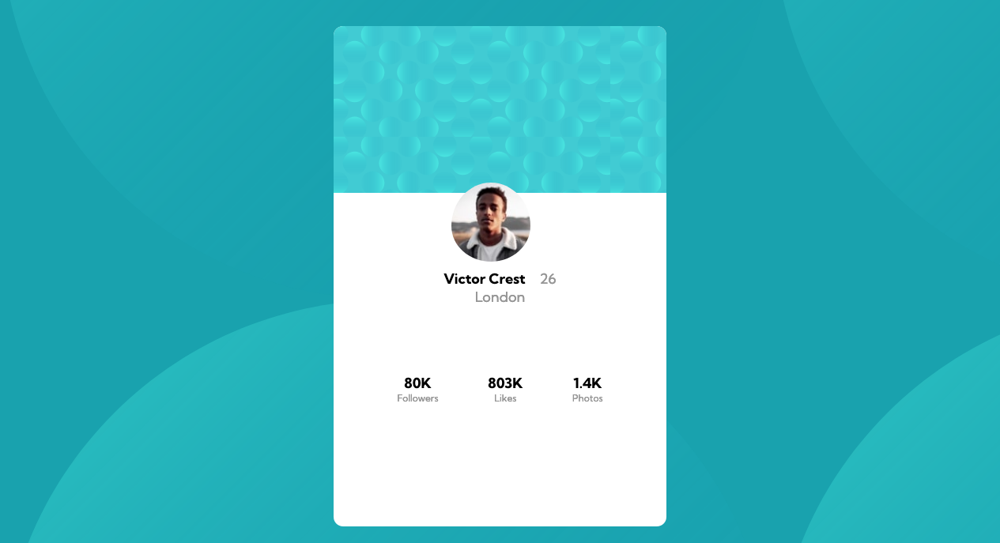

# Frontend Mentor - Profile card component solution

This is a solution to the [Profile card component challenge on Frontend Mentor](https://www.frontendmentor.io/challenges/profile-card-component-cfArpWshJ). Frontend Mentor challenges help you improve your coding skills by building realistic projects. 

## Table of contents

- [Overview](#overview)
  - [The challenge](#the-challenge)
  - [Screenshot](#screenshot)
  - [Links](#links)
- [My process](#my-process)
  - [Built with](#built-with)
  - [What I learned](#what-i-learned)
  - [Continued development](#continued-development)
- [Author](#author)
- [Acknowledgments](#acknowledgments)

## Overview

### The challenge

- Build out the project to the designs provided

### Screenshot



### Links

- Solution URL: [Add solution URL here](https://your-solution-url.com)
- Live Site URL: [Add live site URL here](https://your-live-site-url.com)

## My process

### Built with

- Semantic HTML5 markup
- CSS custom properties
- Flexbox
- CSS Grid

### What I learned

I learned to build a profile card component using css grid layout.


```css
.card {
    display: grid;
    grid-template-columns: repeat(3, 1fr);
    grid-template-rows: repeat(3, 1fr);
    grid-template-areas: "header header header" "content content content" "stats stats stats";
    grid-auto-flow: row;
    width: minmax(333px, 1fr);
}
```


### Continued development

I want to continue learning about css grid layouts to build better websites.

## Author

- Website - [Makram Ibrahim](https://www.sleepingpharaoh.com)
- Frontend Mentor - [@pharaohmak](https://www.frontendmentor.io/profile/pharaohmak)
- Twitter - [@pharaohmak](https://www.twitter.com/pharaohmak)

## Acknowledgments

- Utilize all the tools and resources you have available to help you build the layout of your page.
- use mozilla programmer tools to give a visual grid while you work on your project.
- build the layout first when using css grid and place elements into grid areas.
